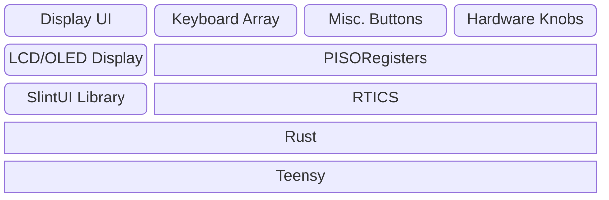
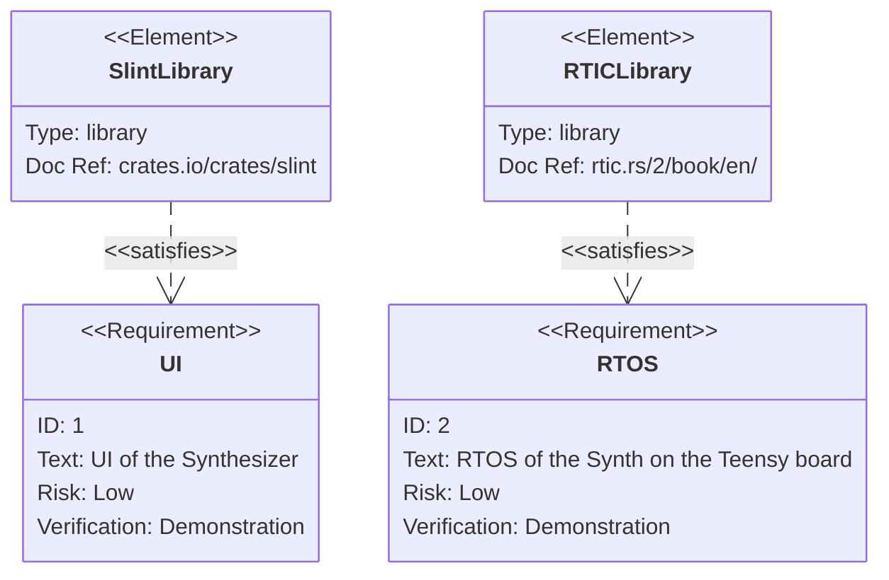

# OpenWave

Basic UI simulation of uSynth. Eventually will become firmware of uSynth.

## Stack

```mermaid
block-beta
    columns 4
    DisplayUI("Display UI")
    HardwareKeyboard("Keyboard Array")
    HardwareButtons("Misc. Buttons")
    HardwareKnobs("Hardware Knobs")

    Display("LCD/OLED Display")
    PISORegisters:3

    SlintLibrary("SlintUI Library")
    RTICS:3
    Rust:4
    Teensy:4
```

## Requirement Diagram

```mermaid
requirementDiagram
    requirement UI {
        id: 1
        Text: UI of the Synthesizer
        Risk: Low
        verifymethod: Demonstration
    }

    requirement RTOS {
        id: 2
        Text: RTOS of the Synth on the Teensy board
        Risk: Low
        verifymethod: Demonstration
    }

    element SlintLibrary {
        type: library
        docRef: crates.io/crates/slint
    }

    element RTICLibrary {
        type: library
        docRef: rtic.rs/2/book/en/
    }

    RTICLibrary - satisfies -> RTOS
    SlintLibrary - satisfies -> UI


```
